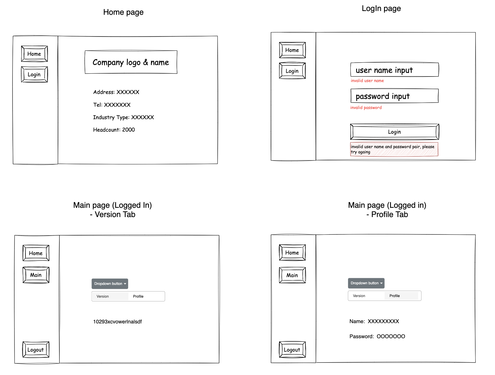

# Simple Login System

## Requirements
### 中文
簡單的登入登出App
==============================================================================

請遵循以下的規則:
- 裡面的所有元件, 請自己命名成合理的名字.
- 原先給的框架請不要改變, 但命名,設定和内容可以更改.
- 請照著自己覺得合理的邏輯去寫.

==============================================================================

- 在 Left 裡面的元件:
	- Button 1:
		- 功能: 首頁: 以下 Right 首頁區看説明.
	- Button 2: 
		- 功能: 登入: 以下 Right 登入區看説明.
	- Button 3:
		- 功能: 登出: 以下 Right 登出區看説明.
- 在 Right 裡面的元件:
	- 首頁: 不管是登入或登出的狀態, 請顯示簡單的公司資訊.
	- 登入: 如果是登出的狀態: 
         - 有個地方讓使用者輸入使用者名稱.
         - 有個地方讓使用者輸入密碼.
         - 有個 Button 可以讓使用者登入.
		   如果是登入的狀態:
         - 正中間放一個下拉選單:
            - 按下下拉選單後下方彈出的選單需要符合以下功能:
               - 選單裡需要有兩個Tabs可以讓使用者選取
                  - 當左邊的Tab被選取時, 使用者需要在選單裡看到版本號 (請給個假的號碼)
                  - 當右邊的Tab被選取時, 使用者需要在選單裡看到登入的名稱和密碼
	- 登出: 讓狀態變成登出


### 英文
Simple Login/Logout App
==============================================================================

Please follow these rules:
   - Name all components with reasonable names.
   - Do not change the given framework, but you can change the naming, settings, and content as you see fit.
   - Write the logic as you think is reasonable.

==============================================================================

- In the Left component:
   - Button 1:
      - Function: Home page. See the description in the Right Home section below.
   - Button 2:
      - Function: Login. See the description in the Right Login section below.
   - Button 3:
      - Function: Logout. See the description in the Right Logout section below.
- In the Right component:
   - Home: Display simple company information regardless of whether the user is logged in or logged out.
   - Login: If in the logged out state:
      - Provide a field for the user to enter their username.
      - Provide a field for the user to enter their password.
      - Include a button for the user to log in.
   - If in the logged in state:
      - Place a dropdown menu in the center:
      - The dropdown menu should have two tabs for user selection:
      - When the left tab is selected, the user should see a version number in the menu (provide a fake number).
      - When the right tab is selected, the user should see the logged-in username and password in the menu.
Logout: Change the state to logged out.

&nbsp;

## Wireframe



&nbsp;

## How to start

```bash
yarn dev
```

&nbsp;
&nbsp;


# Vite building message

This template provides a minimal setup to get React working in Vite with HMR and some ESLint rules.

Currently, two official plugins are available:

- [@vitejs/plugin-react](https://github.com/vitejs/vite-plugin-react/blob/main/packages/plugin-react/README.md) uses [Babel](https://babeljs.io/) for Fast Refresh
- [@vitejs/plugin-react-swc](https://github.com/vitejs/vite-plugin-react-swc) uses [SWC](https://swc.rs/) for Fast Refresh

## Expanding the ESLint configuration

If you are developing a production application, we recommend updating the configuration to enable type aware lint rules:

- Configure the top-level `parserOptions` property like this:

```js
   parserOptions: {
    ecmaVersion: 'latest',
    sourceType: 'module',
    project: ['./tsconfig.json', './tsconfig.node.json'],
    tsconfigRootDir: __dirname,
   },
```

- Replace `plugin:@typescript-eslint/recommended` to `plugin:@typescript-eslint/recommended-type-checked` or `plugin:@typescript-eslint/strict-type-checked`
- Optionally add `plugin:@typescript-eslint/stylistic-type-checked`
- Install [eslint-plugin-react](https://github.com/jsx-eslint/eslint-plugin-react) and add `plugin:react/recommended` & `plugin:react/jsx-runtime` to the `extends` list
